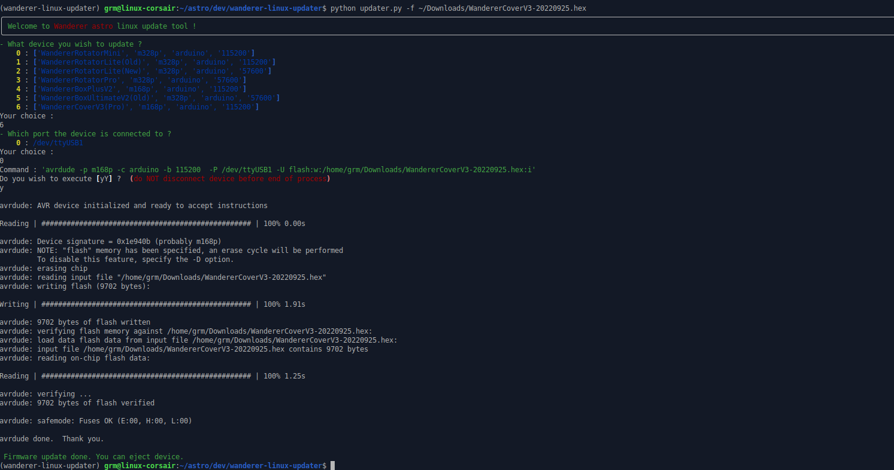

# Wanderer linux updater

This python script aims to automate updating new firmwares on wanderer astro (https://www.wandererastro.com/en/) on Linux.

## Supported devices

- WandererRotatorMini
- WandererRotatorLite(Old)
- WandererRotatorLite(New)
- WandererRotatorPro
- WandererBoxPlusV2
- WandererBoxUltimateV2(Old)
- WandererCoverV3(Pro)

## Installation

You need to install `avrdude` package under linux. This script calls the binary directly.

```bash
$ sudo apt install avrdude
$ pip install pyserial rich requests
$ git clone https://github.com/grm/wanderer-linux-updater
$ cd wanderer-linux-updater
```

##  Update

Simply go into your installation directory and update the repository :
```bash
$ cd wanderer-linux-updater
$ git pull
```

## Usage

The script downloads the latest firmware list from a specified URL and guides you through the update process.

Before starting, you need :
- to know which model of device you want to update (should be easy to find)
- the serial port the device is connected to (something like `/dev/ttyUSB0`)
- the URL to the firmware list

Once you are ready, you can launch the program by executing in a terminal :
```bash
$ python updater.py -u https://od.lk/d/MzNfMzIzNTQ2OTNf/FirmwareDownloadList.txt
```

The script will : 
- download the latest firmware list from the specified URL
- ask you which firmware you want to install (just type the corresponding number)
- ask you which device you want to update (just type the corresponding number)
- then ask you on which port is connected the device : just type the right number for the device
- download the selected firmware to a temporary location
- ask you a confirmation to flash the device. You can answer `y` or `Y`. IT IS VERY IMPORTANT TO NOT DISCONNECT THE DEVICE BEFORE THE END OF THE PROCESS.

## Command Line Options

- `-u, --url`: URL to the firmware list (required)
- `-d`: Do a dry run (print avr command instead of executing it)

Example with custom firmware list:
```bash
$ python updater.py -u https://example.com/my-firmware-list.txt
```

## Screenshot


